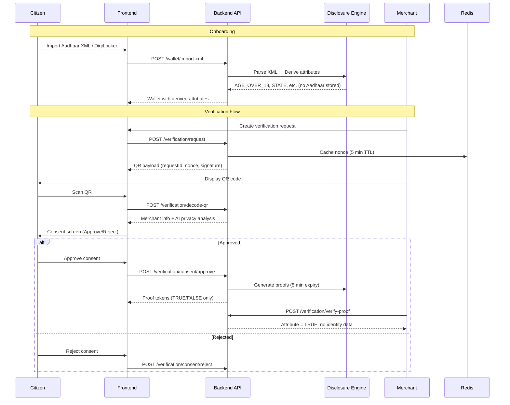

# Verification Sequence

## Key Privacy Guarantees

1. Aadhaar XML parsed in-memory only
2. Only derived attributes stored in wallet
3. Proofs contain TRUE/FALSE values, never source data
4. Audit logs store SHA-256 hashes only
5. QR codes expire in 5 minutes, one-time use
